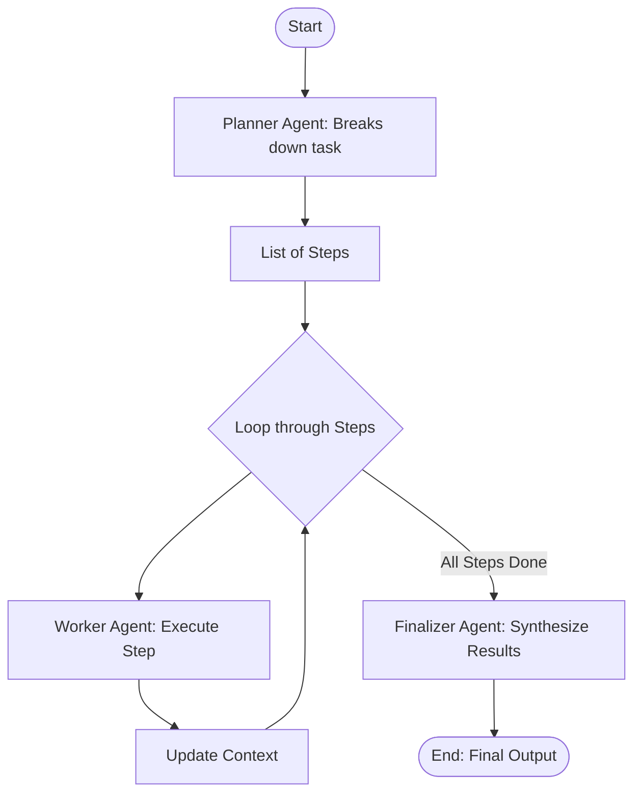

# Planning Pattern in Agentic AI

This project demonstrates the **Planning Pattern**, a strategy where a designated "Planner" agent breaks down a complex user request into manageable sub-tasks, which are then executed sequentially.

## What is the Planning Pattern?

For complex tasks, a single pass by an LLM is often insufficient. The Planning Pattern solves this by separates "thinking" (planning) from "doing" (execution).

1.  **Decomposition**: A Planner Agent analyzes the request and creates a step-by-step plan.
2.  **Execution**: Worker Agents execute each step of the plan, often carrying over context from previous steps.
3.  **Synthesis**: A Finalizer Agent (or the system) consolidates the results into a final answer.

## Planning vs. Reflection

While both patterns involve multiple steps, they serve different purposes:

| Feature | **Planning Pattern** | **Reflection Pattern** |
| :--- | :--- | :--- |
| **Primary Goal** | Break down complex tasks | Improve quality / fix errors |
| **Workflow** | Linear / Sequential (Plan -> Do -> Do) | Cyclic / Iterative (Draft -> Critique -> Edit) |
| **Key Action** | **Decomposition** (Split big task into small ones) | **Self-Correction** (Review and refine output) |
| **Best For** | Multi-step research, coding projects, guides | Creative writing, complex reasoning, logic puzzles |

## Static vs. Dynamic Planning

This example demonstrates **Static Planning**:
-   **Planner Role**: Creates the plan **once** at the start.
-   **Execution**: Workers strictly follow the generated steps.
-   **Pros**: Faster, cheaper (fewer LLM calls), predictable.
-   **Cons**: Rigid; if a step fails or uncovers new info, the plan doesn't adapt.

In **Dynamic Planning** (advanced), the Planner sits *inside* the loop, re-evaluating and modifying the remaining steps after every task execution.

## Flow Diagram



## Code Structure

-   `app.py`: Contains the implementation.
    -   `PlannerAgent`: Breaks the task into 3-5 numbered steps.
    -   `WorkerAgent`: Executes a specific step, seeing the context from previous steps.
    -   `FinalizerAgent`: Takes all the accumulated outputs and writes the final response.
    -   `planning_pipeline`: Logic to parse the plan, loop through execution, and synthesize.

## Usage

Run the application to see the agent plan and execute a guide:

```bash
python app.py
```
