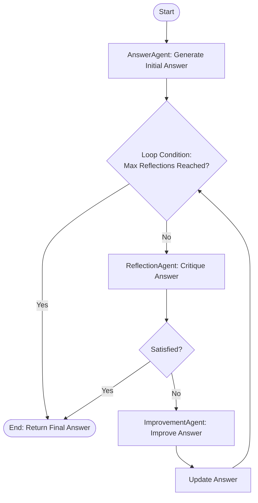

# Reflection Pattern in Agentic AI

This project demonstrates the **Reflection Pattern**, a powerful design pattern for improving the quality and reliability of AI-generated content.

## What is the Reflection Pattern?

The Reflection Pattern involves an iterative process where an AI agent (or a set of agents) critiques its own output and refines it based on that feedback. Instead of accepting the first draft as the final answer, the system engages in a "thought loop" to identify errors, clarify ambiguities, and enhance the overall quality.

## How It Works

The workflow consists of three main stages, often executed by specialized agents:

1.  **Generate (AnswerAgent)**: Produce an initial response to the user's query.
2.  **Reflect (ReflectionAgent)**: Critically evaluate the generated response. Look for logical flaws, missing information, or vague explanations. If the answer is satisfactory, the cycle ends.
3.  **Improve (ImprovementAgent)**: Rewrite the response incorporating the feedback from the reflection stage.

This cycle repeats until the `ReflectionAgent` is satisfied or a maximum number of iterations is reached.

## Flow Diagram



## Implementation Details

All components are consolidated into a single file `app.py` for simplicity:

-   **Agents**:
    -   `AnswerAgent`: Generates the initial draft.
    -   `ReflectionAgent`: Critiques the draft. It has the authority to stop the loop if it deems the answer "SATISFIED".
    -   `ImprovementAgent`: Edits the draft based on the critique.
-   **Logic**:
    -   `reflection_pipeline`: Orchestrates the interaction loop between these agents.

## Key Benefits

-   **Accuracy**: Reduces hallucinations and factual errors by double-checking outputs.
-   **Quality**: Improves clarity, structure, and depth of answers.
-   **Robustness**: Allows the system to self-correct without human intervention.

## Usage

Run the application to see the reflection loop in action:

```bash
python app.py
```
